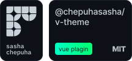

# v-theme (in developing)



[](https://github.com/chepuhasasha/v-theme)
[](https://github.com/chepuhasasha/v-theme)
[](https://github.com/chepuhasasha/v-theme/blob/main/LICENSE)
[](https://packagephobia.now.sh/result?p=@chepuhasasha/v-theme)
[](https://github.com/chepuhasasha/v-lang/issues)

## Contents

- [Quick start](#quick-start)

---

## Install

```
npm install @chepuhasasha/v-theme
```

## Сreate a themes

Создайте объект темы по шаблону.

```json
{
  "YOUR_VARIABLE": "VALUE",
}
```

Выберайте имена переменным как в css, но без использования `"--"`.
например:

## Create the file structure

```
themes/
├---  red.ts/js
├---  blue.ts/js
└---  index.ts/js
```

_red.js/ts_

```js
export default {
  primary: "red",
}
```

_blue.js/ts_

```js
export default {
  primary: "blue",
}
```

_index.js/ts_

```js
import red from "./red.js";
import blue from "./blue.js";

export default {
  red,
  blue,
};
```

## Register the plugin in `main.js/ts`

```js
import { createApp } from "vue";
import App from "./App.vue";
import VTheme from "@chepuhasasha/v-theme";
import themes from "./themes";

createApp(App)
  .use(VTheme, {
    defaultTheme: "blue",
    themes,
  })
  .mount("#app");
```

## Set a Theme

```html
<template>
  <h1>{{ theme }}</h1>
  <button @click="changeTheme">Change theme</button>
</template>

<script lang="ts" setup>
  import { computed } from "vue";
  import { useStore } from "vuex";
  import { key } from "@chepuhasasha/v-theme";

  const store = useStore(key);

  const theme = computed(() => store.getters.THEME);

  const changeTheme = () => {
    if (theme.value === "blue") {
      store.dispatch("setTheme", "red");
      return;
    }
    store.dispatch("setTheme", "blue");
  };
</script>

<style>
  h1 {
    color: var(--primary);
  }
</style>
```
